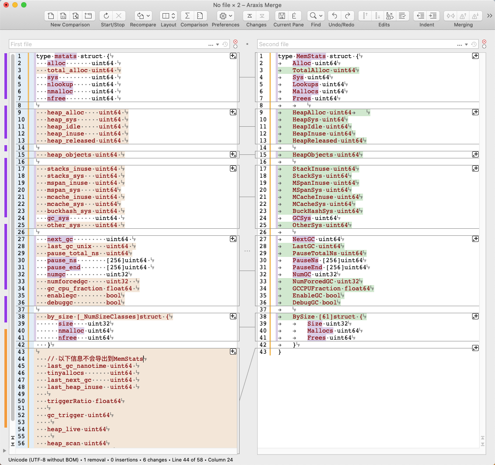

# Go内存统计

Go提供了运行进内存统计的方法，其实现在runtime/mstats.go文件中。go内存统计的作用有：
- Go内存实时监控
- 内存dump时，统计内存相关信息
- Go GC时，统计GC相关的信息
- 应用调试时分析内存分配等

Go中的内存统计信息结构有两个，分别是mstats和MemStats，详细信息如下：

## mstats

```go
// 统计信息。
// 如果您编辑此结构，请同时在下面编辑MemStats类型。它们的布局必须完全匹配。
//
// 有关详细说明，请参阅MemStats文档。与MemStats不同的字段将在此处进一步记录。
//
// 这些字段中的许多都是动态更新的，而其他字段仅在调用updatememstats时才更新。
type mstats struct {
	// 一般统计。
	alloc       uint64 // 已分配但尚未释放的字节
	total_alloc uint64 // 分配的字节（即使已释放）
	sys         uint64 // 从系统获得的字节（应为以下xxx_sys的总和，无锁定，近似值）
	nlookup     uint64 // 指针查找数（未使用）
	nmalloc     uint64 // malloc的次数
	nfree       uint64 // 释放的次数

    // 有关malloc堆的统计信息。
    // 原子更新，或者全局停顿。
    //
    // 与MemStats一样，heap_sys和heap_inuse不会在手动管理的范围内计算内存。
	heap_alloc    uint64 // 已分配但尚未释放的字节（与上面的alloc相同）
	heap_sys      uint64 // 从系统获得的用于GC堆的虚拟地址空间
	heap_idle     uint64 // 空闲跨度（span）中的字节
	heap_inuse    uint64 // mSpanInUse跨度（span）中的字节
	heap_released uint64 // 释放到操作系统的字节

    // 运行时不直接使用heap_objects，而是由updatememstats动态计算。
	heap_objects uint64 // 分配的对象总数

    // 有关低级别固定大小结构分配的统计信息。
    // 受FixAlloc锁保护。
	stacks_inuse uint64 // 手动管理的堆栈跨度中的字节； 自动更新或在STW期间更新
	stacks_sys   uint64 // 仅在mstats中计算newosproc0堆栈； 与MemStats.StackSys不同
	mspan_inuse  uint64 // mspan结构
	mspan_sys    uint64
	mcache_inuse uint64 // mcache结构
	mcache_sys   uint64
	buckhash_sys uint64 // 分析存储桶哈希表
	gc_sys       uint64 // 自动更新或在STW期间更新
	other_sys    uint64 // 自动更新或在STW期间更新

    // 有关垃圾收集器的统计信息。
    //在GC期间受mheap保护或全局停机。
	next_gc         uint64 // 下一个GC何时结束的目标heap_live； ^0（如果禁用）
	last_gc_unix    uint64 // 最后一次gc（Unix时间）
	pause_total_ns  uint64
	pause_ns        [256]uint64 // 最近gc暂停长度的循环缓冲区
	pause_end       [256]uint64 // 最近gc结束时间的循环缓冲区（自1970年以来的纳秒）
	numgc           uint32
	numforcedgc     uint32  // 用户强制GC的数量
	gc_cpu_fraction float64 // GC使用的CPU时间的一部分
	enablegc        bool
	debuggc         bool

    // 有关分配大小类的统计信息。

	by_size [_NumSizeClasses]struct {
		size    uint32
		nmalloc uint64
		nfree   uint64
	}

    // 下面的统计信息不会直接导出到MemStats。

	last_gc_nanotime uint64 // 最后gc（单调时间）
	tinyallocs       uint64 // 不会导致实际分配的微小分配的数量； 没有直接导出到go
	last_next_gc     uint64 // 上一个GC：next_gc
	last_heap_inuse  uint64 // 前一个GC的标记终止处的heap_inuse

    // triggerRatio是触发标记的堆增长比率。
    //
    // 例如，如果该值为0.6，则当活动堆达到上一个周期标记的堆大小的1.6倍时，GC应该启动。
    // 该值应≤GOGC/100，以便触发器堆大小小于目标堆大小。这是在标记终止期间为下一个循环的触发设置的。
	triggerRatio float64

    //
    // gc_trigger是触发标记的堆大小。
    //
    // 当heap_live≥gc_trigger时，标记阶段将开始。
    // 这也是必须完成比例扫描的堆大小。
    //
    // 这是在标记终止期间为下一个循环的触发器从triggerRatio计算的。
	gc_trigger uint64

    // heap_live是GC认为存活的字节数。
    // 即：由最近的GC保留，此后再分配。 heap_live <= heap_alloc，
    // 因为heap_alloc包括尚未被清除的未标记对象（因此在我们分配时上升，而在扫描时下降），
    // 而heap_live排除这些对象（因此仅在GC之间上升）。
    //
    // 这是自动更新的，没有锁定。为了减少争用，仅当从一个mcentrol获得一个跨度(span)时才更新该争用，
    // 此时，它会计算该跨度中所有未分配的槽位（在该mcache从该mcentrol获取另一个跨度之前将对其进行分配）。
    // 因此，它稍微高估了“真实”活动堆的大小。最好高估而不是低估，因为
    //  1）触发GC的时间比必要的要早，而不是可能太晚； 
    //  2）导致保守的GC速率，而不是可能太低的GC速率。
    //
    // 读取应该同样是原子的（或在STW期间）。
    //
    // 每当更新时，都调用traceHeapAlloc()和gcController.revise()。
	heap_live uint64

    // heap_scan是“可扫描”堆的字节数。这是活动堆（由heap_live计算），
    // 但是省略了非扫描对象和对象的非扫描尾部。
    //
    // 每当更新时，都调用gcController.revise()。
	heap_scan uint64

	// heap_marked是前一个GC标记的字节数。标记终止后，heap_live == heap_marked， 
	// 但是与heap_live不同，heap_marked直到下一个标记终止才更改。
	heap_marked uint64
}
```

## MemStats
```go
// MemStats记录有关内存分配器的统计信息。
type MemStats struct {
    // 常规统计信息。

    // Alloc是分配的堆对象的字节。
    //
    // 这与HeapAlloc相同（请参见下文）。
	Alloc uint64

    // TotalAlloc是分配给堆对象的累积字节。
    //
    // TotalAlloc随着分配堆对象而增加，但是与Alloc和HeapAlloc不同，释放对象时它不会减少。
	TotalAlloc uint64

    // Sys是从OS获得的内存的总字节数。
    //
    // Sys是以下XSys字段的总和。 Sys衡量Go运行时为堆，栈和其他内部数据结构保留的虚拟地址空间。
    // 在任何给定时刻，可能并非所有虚拟地址空间都由物理内存支持，尽管通常情况下，所有虚拟地址空间都在某个时刻。
	Sys uint64

    // Lookups是运行时执行的指针查找的次数。
    //
    // 这主要用于调试运行时内部。
	Lookups uint64

    // Mallocs是分配的堆对象的累积计数。
    // 活动对象的数量为Malloc-Frees。
	Mallocs uint64

    // Frees是已释放的堆对象的累积计数。
	Frees uint64

    // 堆内存统计信息。
    //
    // 解释堆统计信息需要了解Go如何组织内存。 Go将堆的虚拟地址空间划分为跨度（“span”），
    // 即内存8K或更大的连续区域。跨度可能处于以下三种状态之一：
    //
    // “空闲”跨度（span）不包含任何对象或其他数据。支持空闲范围的物理内存可以释放回操作系统
    // （但虚拟地址空间永远不会释放），也可以将其转换为“使用中”或“堆栈”跨度（span）。
    //
    // 一个“使用中”的跨度至少包含一个堆对象，并且可能具有可用空间来分配更多的堆对象。
    //
    // “堆栈”跨度用于goroutine堆栈。堆栈跨度不视为堆的一部分。跨度可以在堆和堆栈内存之间改变；永远不会同时使用它们。
    // 
    // HeapAlloc是分配的堆对象的字节。
    //
    // “已分配”堆对象包括所有可访问对象，以及垃圾回收器尚未释放的不可访问对象。
    // 具体来说，HeapAlloc随着分配堆对象而增加，而随着堆被清除而无法访问的对象被释放而减少。
    // 清除过程在GC周期之间逐渐发生，因此这两个过程同时发生，因此HeapAlloc趋于平稳变化
    // （与全局停机的垃圾收集器所采用的典型锯齿形成对比）。
	HeapAlloc uint64

    // HeapSys是从操作系统获得的堆内存字节。
    //
    // HeapSys测量为堆保留的虚拟地址空间量。这包括已保留但尚未使用的虚拟地址空间，
    // 该虚拟地址空间不占用物理内存，但往往很小，以及在物理内存变得不使用后已将其
    // 返回给操作系统的虚拟地址空间（请参阅HeapReleased以衡量后者）。
    //
    // HeapSys估计堆具有的最大大小。
	HeapSys uint64

    // HeapIdle是空闲（未使用）跨度中的字节。
    //
    // 空闲跨度中没有对象。这些范围可以（并且可能已经）返回到操作系统，
    // 或者可以重新用于堆分配，或者可以重新用作栈内存。
    //
    // HeapIdle减去HeapReleased估计可以返回给OS的内存量，但是该内存将由运行时保留，
    // 因此它可以增长堆而无需从OS请求更多内存。如果此差异明显大于堆大小，
    // 则表明活动堆大小最近出现了短暂的峰值。
	HeapIdle uint64

    // HeapInuse是使用中的跨度中的字节。
    //
    // 使用中的跨度中至少包含一个对象。这些跨度只能用于大小大致相同的其他对象。
    //
    // HeapInuse减去HeapAlloc估计专用于特定大小类别的内存量，但当前未使用。这是碎片的上限，但是通常可以有效地重用此内存。
	HeapInuse uint64

    // HeapReleased是返回操作系统的物理内存字节。
    //
    // 这将从返回到OS且尚未为堆重新获取的span范围中计算堆内存。
	HeapReleased uint64

    // HeapObjects是分配的堆对象的数量。
    //
    // 像HeapAlloc一样，随着分配对象的增加，它会增加；而随着堆的清除和无法访问的对象的释放，这会减少。
	HeapObjects uint64

    // 栈内存统计信息。
    //
    // 栈不被视为堆的一部分，但是运行时可以将堆内存的一部分重用于栈内存，反之亦然。

    // StackInuse是栈跨度中的字节。
    //
    // 使用中的栈跨度中至少包含一个栈。这些跨度只能用于相同大小的其他栈。
    //
    // 没有StackIdle，因为未使用的栈范围返回到堆中（因此计入HeapIdle）
	StackInuse uint64

    // StackSys是从OS获得的栈内存的字节。
    //
    // StackSys是StackInuse，再加上直接从OS获取的用于OS线程栈的任何内存（应该很少）。
	StackSys uint64

    // 堆外内存统计信息。
    //
    // 以下统计信息将度量未从堆内存分配的运行时内部结构（通常是因为它们是实现堆的一部分）。
    // 与堆或栈内存不同，分配给这些结构的任何内存都专用于这些结构。
    //
    // 这些主要用于调试运行时内存开销。

    // MSpanInuse是分配的mspan结构的字节。
	MSpanInuse uint64

    // MSpanSys是从操作系统获取的用于mspan结构的内存字节。
	MSpanSys uint64

    // MCacheInuse是分配的mcache结构的字节。
	MCacheInuse uint64

    // MCacheSys是从操作系统获取的用于mcache结构的内存字节。
	MCacheSys uint64

    // BuckHashSys是分析存储桶哈希表中的内存字节。
	BuckHashSys uint64

    // GCSys是垃圾回收元数据中的内存字节。
	GCSys uint64

    // OtherSys是其他堆外运行时分配中的内存字节。
	OtherSys uint64

	// Garbage collector statistics.
    // 垃圾收集器统计信息。

    // NextGC是下一个GC周期的目标堆大小。
    //
    // 垃圾收集器的目标是保持HeapAlloc≤NextGC。
    // 在每个GC周期结束时，根据可获得的数据量和GOGC的值计算下一个周期的目标。
	NextGC uint64

    // LastGC是最后一次垃圾回收完成的时间，自1970年（UNIX时代）以来，以纳秒为单位。
	LastGC uint64

    // PauseTotalNs是自程序启动以来，GC全局停机暂停的累积纳秒。
    //
    // 在全局停机暂停期间，所有goroutine都将暂停并且只有垃圾收集器可以运行。
	PauseTotalNs uint64

    // PauseNs是最近GC全局停机暂停时间（以纳秒为单位）的循环缓冲区。
    //
    // 最近的暂停是在PauseNs[(NumGC+255)%56]处。通常，PauseNs[N%256]记录最近的第N%256个GC周期中暂停的时间。
    // 每个GC周期可能会有多个暂停；这是一个周期中所有暂停的总和。
	PauseNs [256]uint64

    // PauseEnd是最近的GC暂停结束时间的循环缓冲区，自1970年（UNIX时代）以来为纳秒。
    //
    // 此缓冲区的填充方式与PauseNs相同。每个GC周期可能会有多个暂停；这将记录一个周期中最后一个暂停的结束。
	PauseEnd [256]uint64

    // NumGC是已完成的GC周期数。
	NumGC uint32

    // NumForcedGC是应用程序调用GC函数强制执行的GC周期数。
	NumForcedGC uint32

    // 自程序启动以来，GCCPUFraction是该程序使用的该程序可用CPU时间的一部分。
    //
    // GCCPUFraction表示为0到1之间的数字，其中0表示GC没有消耗该程序的CPU。
    // 自程序启动以来，程序的可用CPU时间定义为GOMAXPROCS的整数。也就是说，
    // 如果GOMAXPROCS为2且程序已运行10秒钟，则其“可用CPU”为20秒钟。 
    //  GCCPUFraction不包括用于写屏障活动的CPU时间。
    //
    // 这与GODEBUG = gctrace = 1报告的CPU分数相同。
	GCCPUFraction float64

    // EnableGC表示已启用GC。即使GOGC = off，也总是如此
	EnableGC bool

    // // DebugGC当前未使用。
	DebugGC bool

    // BySize报告按大小分类分配的统计信息。
    //
    // BySize [N]给出大小为S的分配的统计信息，其中
    // BySize [N-1] .Size <S≤BySize [N] .Size。
    //
    // 这不会报告大于BySize [60] .Size的分配。
	BySize [61]struct {
        // Size是此size类中对象的最大字节大小。
		Size uint32

        // Mallocs是在此size类中分配的堆对象的累积计数。分配的累积字节为Size * Mallocs。
        // 此大小类中的活动对象数量为Mallocs-Frees。
		Mallocs uint64

        // Frees是在此size类中释放的堆对象的累积计数。
		Frees uint64
	}
}

```
mstats和MemStats的区别有：
- mstats供内部使用，MemStats供外部使用
- mstats和MemStats的字段大部分是对应的，从by_size(BySize)开始有差别。



## 使用
```go
type Garbage struct{ a int }

func notify(f *Garbage) {
	stats := &runtime.MemStats{}
	runtime.ReadMemStats(stats)

	bytes, _ := json.MarshalIndent(stats, "", "    ")
	fmt.Println(string(bytes))

	go ProduceFinalizedGarbage()
}

func ProduceFinalizedGarbage() {
	x := &Garbage{}
	runtime.SetFinalizer(x, notify)
}

func main() {
	go ProduceFinalizedGarbage()

	for {
		runtime.GC()
		time.Sleep(10 * time.Second)
	}
}
```
